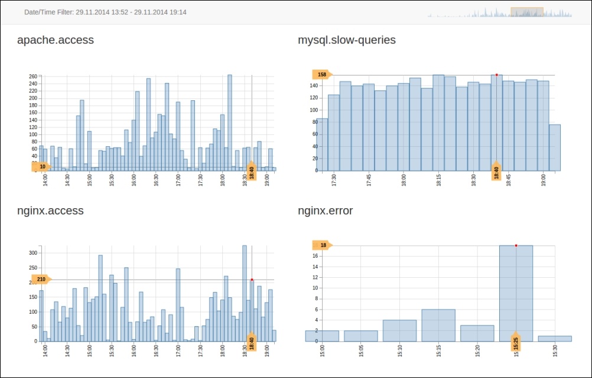

# angularjs-server-monitoring
AngularJS - Server Monitoring

Preview of the application

Based on:

'Create a Real Time Server Monitoring App with AngularJS and NodeJS'

at:

Page 1

https://www.dunebook.com/create-real-time-server-monitoring-app-with-angularjs-and-nodejs/

Page 2

https://www.dunebook.com/create-real-time-server-monitoring-app-with-angularjs-and-nodejs/2/

Page 3

https://www.dunebook.com/create-real-time-server-monitoring-app-with-angularjs-and-nodejs/3/

Page 4

https://www.dunebook.com/create-real-time-server-monitoring-app-with-angularjs-and-nodejs/4/

Page 5

https://www.dunebook.com/create-real-time-server-monitoring-app-with-angularjs-and-nodejs/5/

Page 6

https://www.dunebook.com/create-real-time-server-monitoring-app-with-angularjs-and-nodejs/6/

Page 7

https://www.dunebook.com/create-real-time-server-monitoring-app-with-angularjs-and-nodejs/7/

